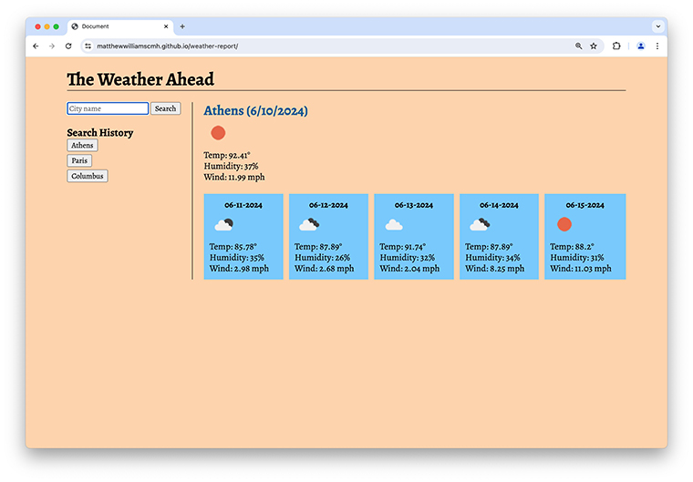

# Project Title
The Weather Ahead, Challenge 6

## Description
The Weather Ahead returns forecasts for today and the next five days for a requested city.

## Installation
The Weather Ahead requires no installation.

## Usage
A screen shot of The Weather Ahead is presented below. To link to the app, click [here](https://matthewwilliamscmh.github.io/weather-report/).

.

Written in HTML, CSS, and Javascript, The Weather Ahead offers users a way to check the temperature, humidity, wind speed, and—through an icon—the level of cloud cover and precipitation in a specified city for today and the next five days. The Weather Ahead pulls data from the openweathermap.org api. On opening The Weather Ahead, users are presented with a search box into which they type the name of the city whose weather they want to check. The search button retrieves the data from openweathermap if the city is found in the openweathermap api database. If the city is not found, users are asked to verify their spelling or provide the name of a larger city near the location whose forecast they are checking. Upon successfully identifying a city in the database, openweathermap returns 40 three-hour forecasts, spanning five to six days. The Weather Ahead pairs that list down to the forecast nearest to the current date and time, the noon forecasts for the next five days, and the last available forecast provided for day five. If users are checking the forecast before 6 a.m., the results will include two forecasts for today, so the second forecast for today is discarded. Similarly, under certain conditions, the pared-down list of results will include two forecasts for the fifth day, in which case, the later of the two forecasts is discarded.

The ten most recent searches are stored in the users' local storage for later retrieval. Buttons on the left-hand side of the page provide users with access to previous searches. Multiple searches to the same city are stored only one time.

Future enhancements may include allowing more granular city selection. For example, the app might allow users to specify "Athens, Greece" or "Athens, Ohio" rather than simply assuming "Athens" to mean Athens, Greece.

## Credits
Our class worked through the unit's mini-project to understand how this application should work and to provide a model to refer to as we developed this weather-reporting app. I relied on a lot of hints and refreshers from the web sites, among the most helpful of which were specific-case posts on [Stack Overflow](https://stackoverflow.com), [SheCodes](https://www.shecodes.io/athena/), [MDN Web Docs](https://developer.mozilla.org), and [W3Schools](https://www.w3schools.com). Slavic Andreev helped me sort out code that was failing to pass coordinates from one function to another. Rene Trevino provided a link to an improved api on openweathermap and helped me stabilize my application flow after I had untangled the spaghetti code I had written to reach minimum-viable-product status.

## Version History
* 0.1
    * Initial Releasse

## License
The Weather Ahead is licensed under the MIT License - see the LICENSE.md file for details.